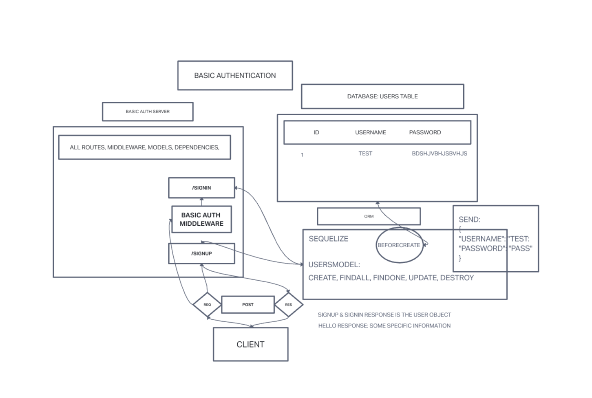

# BASIC AUTH

## Author: Luis Rosales

## Problem Domain

A api server inteded to practice server modularization, basic auth, use of middleware, routes, CRUD, writing tests and overall best practices.

## Dependencies

* node
* dotenv
* express
* jest
* supertest
* sqlite3
* sequelize-cli
* sequelize
* pg
* Bcrypt
* base64

### Setup

* npm init
* env
* npm i dotenv, supertest, jest, express, pg, sequelize, sequelize-cli, sqlite3, Bcrypt, base64

### Tests

* 404 on a bad route
* Does the middleware function (send it a basic header)
* Do the routes assert the requirements (signup/signin)

### UML

